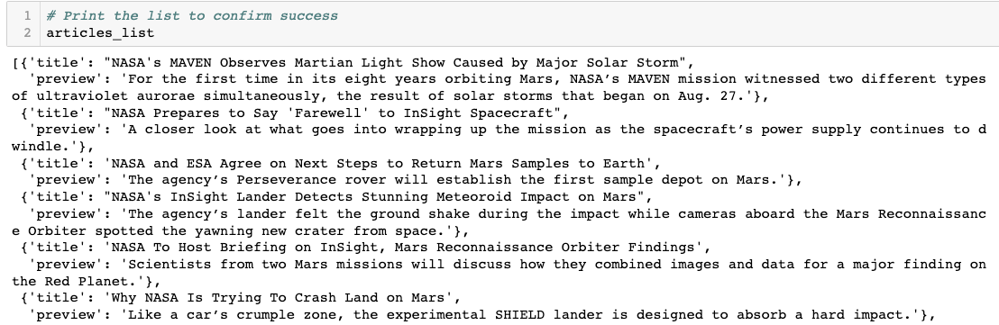
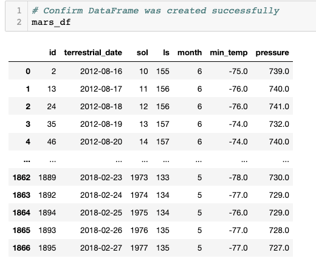
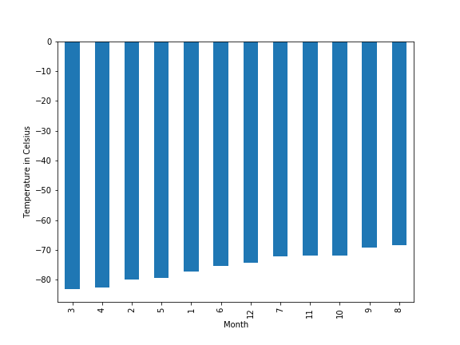
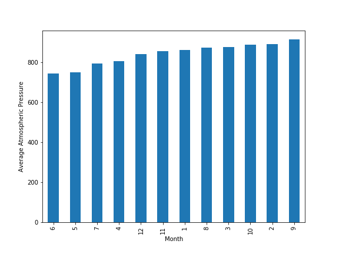
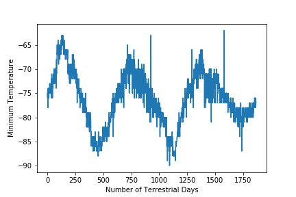

# data-collection-challenge
Module 11 challenge

### Background
You’re now ready to take on a full web-scraping and data analysis project. You’ve learned to identify HTML elements on a page, identify their id and class attributes, and use this knowledge to extract information via both automated browsing with Splinter and HTML parsing with Beautiful Soup. You’ve also learned to scrape various types of information. These include HTML tables and recurring elements, like multiple news articles on a webpage.

### This contains two technical products from the Mars news site:

1. Scrape titles and preview text from Mars news articles.

2. Scrape and analyze Mars weather data, which exists in a table.

### Part 1: Scrape Titles and Preview Text from Mars News
See "part_1_mars_news.ipynb" file for commented code.
[part_1_mars_news](part_1_mars_news.ipynb)

#### Results
* Image of scraped Mars News as list of dictionaries

* Also exported scraped data to JSON file
[Mars_Articles](Mars_Articles.json)

### Part 2: Scrape and Analyze Mars Weather Data
See "part_2_mars_weather.ipynb" file for commented code.
[part_2_mars_weather](part_2_mars_weather.ipynb)

#### Results
* Image of scraped table in dataframe

* Data has been written to a CSV file
[mars_weather_data](mars_weather_data)

#### Data Analysis
* The coldest and hottest months (of Curiosity's location) on Mars, sorted from coldest to warmest.
On average, the third month has the coldest minimum temperature on Mars, and the eighth month is the warmest.

* Average atmospheric pressure. The atmospheric pressure is, on average, lowest in the sixth month and highest in the ninth.

* Earth days in a Martian year. The distance from peak to peak is roughly 1425-750, or 675 days. A year on Mars appears to be about 675 days from the plot. Internet search confirms that a Mars year is equivalent to 687 earth days.

